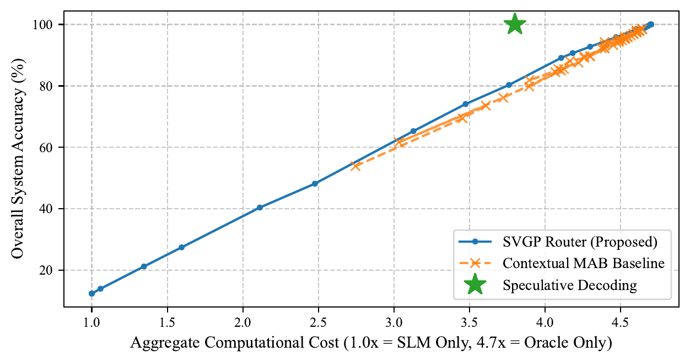
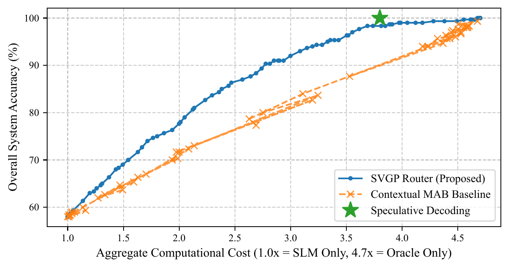

# Multi-Fidelity LLM Routing with Sparse Variational Gaussian Processes

Code for my undergraduate thesis at Western University (April 2026), *Incorporating Domain Knowledge in Multi-Fidelity Machine Learning Methods*.

- 📄 [Thesis (PDF)](docs/thesis.pdf)
- 📊 [Presentation slides (PDF)](docs/presentation.pdf)

## The idea
Small language models (SLMs) are cheap but unreliable on hard queries; large models are reliable but expensive. This router decides **before any tokens are generated** whether the SLM will succeed, and escalates to a large "Oracle" model only when it predicts failure or is uncertain.

1. Run a single forward pass of the SLM and take its final hidden state as a semantic embedding of the query.
2. Compress the embedding to 10 dimensions with PCA.
3. A Sparse Variational Gaussian Process (GPyTorch, RBF kernel with ARD, Bernoulli likelihood) predicts the probability that the SLM succeeds, along with its uncertainty.
4. A tunable confidence threshold decides between the SLM and the Oracle, giving a full cost-accuracy curve instead of a single operating point.

## Results
Evaluated against a Thompson Sampling contextual multi-armed bandit (CMAB) and speculative decoding:

- **MBPP (code generation, execution-verified):** the SVGP router gives higher accuracy than the CMAB at every compute budget. The CMAB's online "exploration tax" keeps it from operating below ~2.8x cost, while the SVGP covers the full range from SLM-only (1.0x) to Oracle-only (4.7x). Speculative decoding reaches full accuracy but only at a fixed ~3.8x cost.
- **MMLU (57 subjects):** the router picks up semantic clusters of SLM competence in latent space and produces a convex trade-off curve that clearly beats the CMAB.

| MBPP | MMLU |
|------|------|
|  |  |

## Files
| File | Purpose |
|------|---------|
| `generate_data.py` | MBPP: runs SmolLM2-360M-Instruct, executes its code in a sandbox to label success/failure, and saves hidden-state embeddings |
| `train_router.py` | PCA + SVGP router training on MBPP embeddings |
| `plot_tradeoffs.py` | MBPP cost-accuracy curves against the CMAB and speculative decoding baselines |
| `1_generate_and_judge.py` | MMLU: runs Qwen2.5-1.5B-Instruct and labels answers with an LLM judge (needs `OPENAI_API_KEY`) |
| `2_extract_embeddings.py` | MMLU: extracts SLM hidden-state embeddings |
| `3_nlp_router_evaluation.py` | MMLU: SVGP router evaluation and trade-off curves |
| `*.npy` | Pre-computed embeddings and labels, so the router scripts run without regenerating data |

## Setup
```bash
pip install torch gpytorch transformers datasets scikit-learn numpy matplotlib openai
python train_router.py
python plot_tradeoffs.py
```
